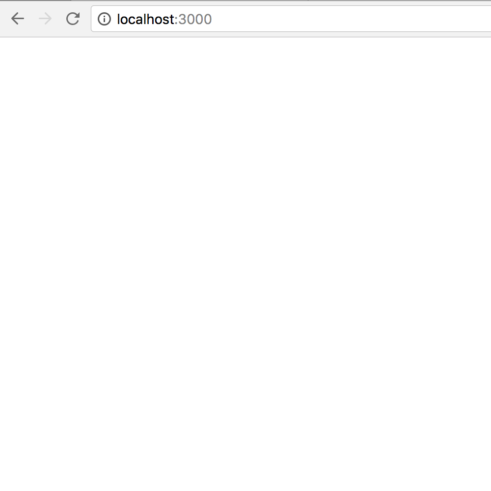

This project was bootstrapped with [Create React App](https://github.com/facebookincubator/create-react-app).

## Getting Started
```
git clone https://github.com/robtaussig/reactReduxTemplate.git

cd reactReduxTemplate

yarn install

yarn start

//In new process

yarn watch-css
```

- Root file located at src/App.jsx
- Template for Containers located at src/SmartTemplate.jsx
- Template for Components located at src/DumbTemplate.jsx

### Without Changes



### With Changes

```
#src/App.jsx

render () {
  return (
    <div className={'app'}>
      Welcome!
    </div>
  );
}

#src/App.scss

.app {
  font-size: 30px;
  color: dodgerblue;
  width: 500px;
  height: 500px;
  text-align: center;
  line-height: 300px;
}

```

